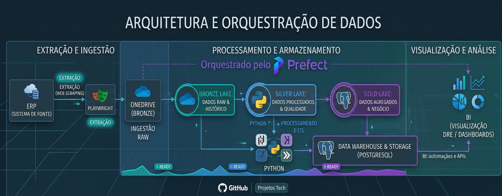
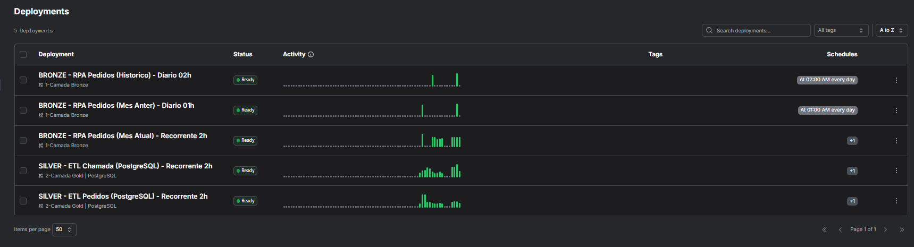
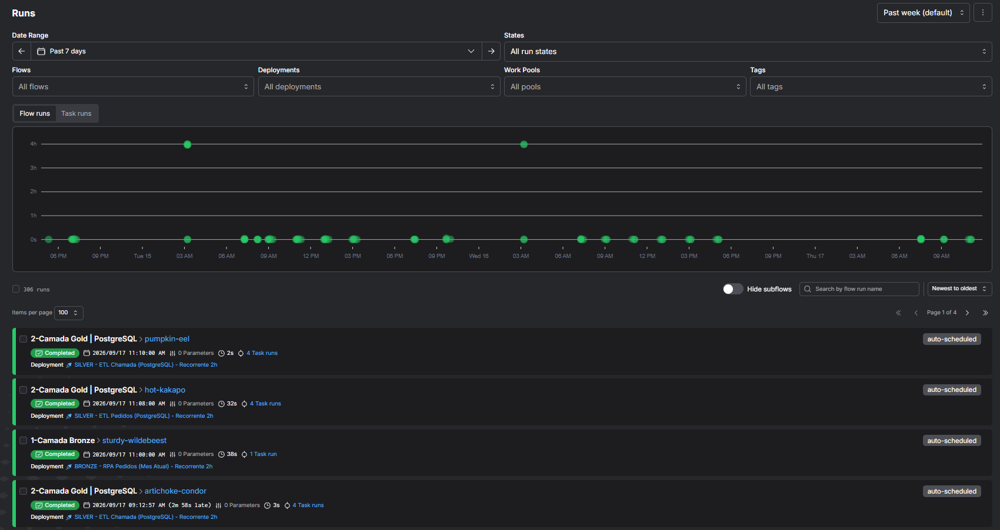

# Case: construção de uma arquitetura medalhão com Python

> Documentação pública e sanitizada de uma arquitetura de dados em camadas
> Bronze, Silver e Gold, criada para separar ingestão, tratamento e consumo.

> [!WARNING]
> O repositório não contém credenciais, dados reais, arquivos `.env`, caminhos
> locais ou configurações de infraestrutura. A documentação descreve decisões
> técnicas sem reproduzir informações corporativas sensíveis.

## Contexto e problema

O ponto de partida era um conjunto de rotinas de extração, tratamento e
disponibilização executadas no mesmo projeto. Quando essas responsabilidades
ficam misturadas, mudanças em uma etapa aumentam o risco de afetar as demais e
torna-se mais difícil reprocessar ou validar uma carga.

A arquitetura medalhão foi adotada para separar responsabilidades, facilitar a
manutenção e permitir que cada etapa seja validada de forma independente.

## Minha atuação

Atuei na estruturação e documentação das frentes representadas no projeto:

- organização do fluxo de extração e carga inicial;
- definição das responsabilidades das camadas Bronze, Silver e Gold;
- aplicação de regras de limpeza, tipagem e validação;
- organização da persistência e do reprocessamento;
- documentação do fluxo, decisões e próximos passos.

## Arquitetura atual



## Como a estrutura atual funciona

### 1. Bronze: preservar a origem

A primeira camada concentra as rotinas de extracao e carga inicial. Seu principio e manter rastreabilidade: os dados chegam da origem, recebem o minimo de tratamento necessario para persistencia e ficam disponiveis para reprocessamento historico.

Responsabilidades:

- conectar-se as fontes por configuracao externa;
- extrair dados atuais e historicos;
- persistir arquivos ou tabelas de entrada;
- registrar o periodo processado e eventuais falhas.

### 2. Silver: transformar em dados confiaveis

A segunda camada aplica padronizacao, limpeza, tipagem e regras de negocio. E aqui que os dados deixam de ser apenas uma copia da origem e passam a ter um contrato mais estavel para os consumidores.

Responsabilidades:

- normalizar nomes e tipos de colunas;
- tratar nulos e duplicidades;
- validar chaves e datas;
- consolidar conjuntos relacionados;
- gerar saídas consistentes para a camada Gold.

### 3. Gold: disponibilizar valor

A camada Gold organiza os dados tratados para consumo. Ela pode expor servicos, tabelas analiticas, endpoints ou rotinas de automacao, de acordo com a necessidade do negocio.

Responsabilidades:

- disponibilizar dados prontos para consumo;
- reduzir a complexidade para BI e automacoes;
- aplicar filtros e agregacoes de uso recorrente;
- monitorar a execução do fluxo.

## Ordem de processamento atual

```text
Fonte -> Bronze -> Silver -> Gold -> Consumidores
```

Cada etapa deve terminar com sucesso antes da seguinte começar. O fluxo atual
documenta essa dependência; mecanismos adicionais de orquestração são tratados
como evolução quando ainda não fazem parte da implementação publicada.

## Operação observada

As capturas abaixo mostram a operação documentada: deployments organizados por
camada e histórico de runs concluídas.

### Deployments por camada



### Runs do pipeline



## Decisões de engenharia

| Decisao | Motivo |
| --- | --- |
| Separar o pipeline em tres camadas | Reduz acoplamento e facilita testes |
| Manter credenciais fora do codigo | Evita vazamento e permite ambientes diferentes |
| Preservar a Bronze | Permite auditoria e reprocessamento |
| Centralizar transformacoes na Silver | Evita regras duplicadas nos consumidores |
| Entregar dados orientados ao consumo na Gold | Simplifica BI, APIs e automacoes |

As decisões acima representam princípios documentados no projeto. Scheduler,
retries, alertas, contratos versionados e CI/CD só devem ser considerados
capacidades atuais quando estiverem implementados e verificáveis no repositório.

## Seguranca e reproducibilidade

O case publico nao contem credenciais, dados reais, arquivos `.env`, dumps, caminhos locais ou configuracoes de infraestrutura. Em um ambiente real, use um gerenciador de segredos, variaveis de ambiente e permissoes de menor privilegio.

Exemplo de configuracao local:

```env
SOURCE_HOST=seu-host
SOURCE_DATABASE=seu-banco
SOURCE_USER=seu-usuario
SOURCE_SECRET_REF=use-um-gerenciador-de-segredos
```

## Impacto / resultado

A arquitetura cria uma fronteira clara entre ingestão, qualidade e consumo.
Isso facilita localizar responsabilidades, validar cada etapa e evoluir o fluxo
sem misturar regras de origem com regras de consumo.

## Evoluções planejadas

- adicionar testes de qualidade por camada;
- versionar contratos de dados;
- incluir logs estruturados e metricas;
- automatizar a execução com scheduler e CI/CD;
- adicionar retries e alertas para falhas;
- substituir arquivos intermediarios por tabelas gerenciadas quando necessário.